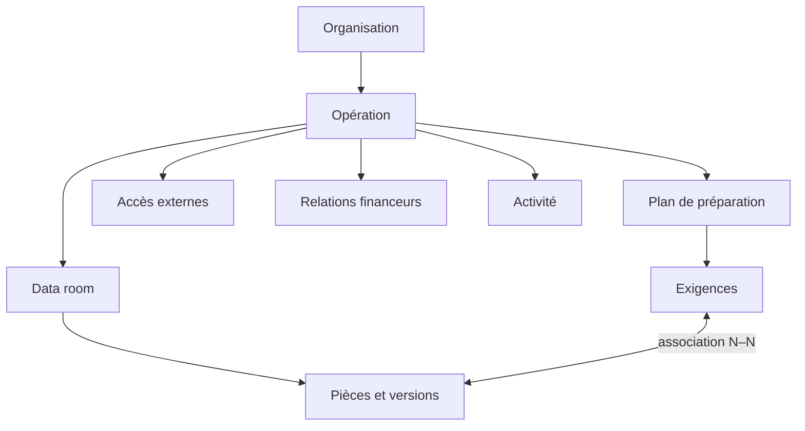

# Sanza V2 — modèle de données logique

Ce document décrit le modèle cible. Il ne constitue pas encore une migration
SQL.

## Agrégats

## Entités principales

| Entité | Responsabilité | Invariants principaux |
|---|---|---|
| Organisation | Identité stable de l’entreprise | Propriétaire des opérations et pièces |
| Opération | Financement ou diligence | Privée à la création ; cycle de vie explicite |
| Plan | Contexte juridiction + financeur | Versionné pour expliquer les exigences générées |
| Exigence | Élément attendu | Niveau et état indépendants du dossier |
| Dossier | Classement de la data room | Modifiable sans modifier les exigences |
| Pièce | Document logique | Une version active ; peut satisfaire plusieurs exigences |
| Version | Fichier immuable | Auteur, date, commentaire et clé Storage |
| Accès | Périmètre accordé à un tiers | Expiration et révocation immédiate |
| Relation financeur | Suivi commercial | Ne déduit jamais l’intention depuis l’activité |
| Événement d’activité | Fait documentaire | Immuable et attribué |

## Séparations obligatoires

### Relation, accès et engagement

Trois champs ou ensembles d’événements distincts :

- étape de relation ;
- état technique de l’accès ;
- niveau d’engagement et montant déclaré.

Une consultation ne change jamais automatiquement l’étape de relation ou
l’engagement.

### Exigence et arborescence

Une exigence appartient au plan. Une pièce appartient à un dossier. Une table
d’association N–N relie les deux. Déplacer une pièce ne détruit donc pas son
lien avec le plan.

### Interne et externe

Les collaborateurs appartiennent à l’organisation et possèdent des capacités.
Les invités possèdent un accès limité à une opération. Un invité externe
n’obtient pas de droit de modification dans le MVP.

## Tables candidates

Noms indicatifs à valider avant migration :

- `operations`
- `preparation_plans`
- `preparation_requirements`
- `operation_folders`
- `operation_documents`
- `document_versions`
- `requirement_documents`
- `external_accesses`
- `external_access_scopes`
- `investor_relations`
- `operation_activities`
- `security_events`

## Contraintes Supabase

- RLS activée sur toute table exposée.
- RPCs auditables pour les écritures sensibles.
- Vues avec `security_invoker = on`.
- Politiques Storage alignées sur les accès aux métadonnées.
- Une opération archivée ou un abonnement expiré reste exportable en lecture
  seule.
- Les clés Storage utilisent un nom assaini ; le nom d’affichage original est
  conservé séparément.

## Stratégie de migration

1. Cartographier les tables V1 et les données réellement utilisées.
2. Valider le modèle cible avec les maquettes.
3. Créer une migration par capacité verticale avec `supabase migration new`.
4. Appliquer et tester d’abord sur le projet Supabase V2.
5. Vérifier les policies avec des sessions owner, contributor et guest.
6. Ne préparer la migration de production qu’après un test de retour arrière.
